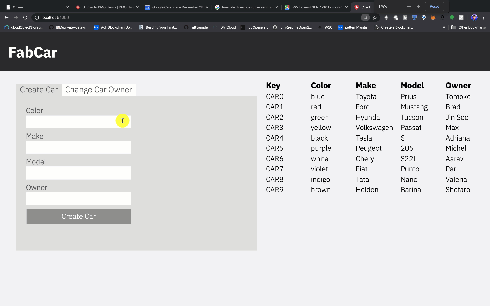
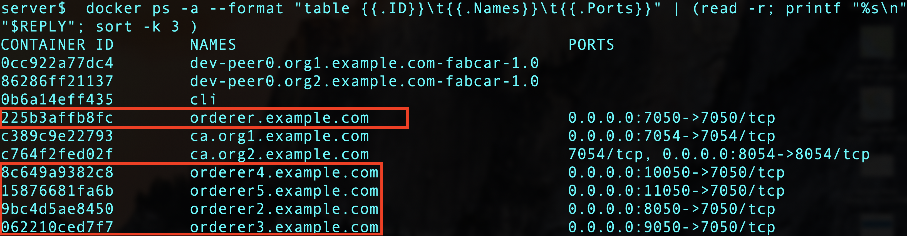
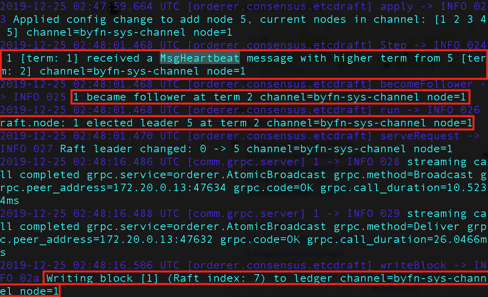
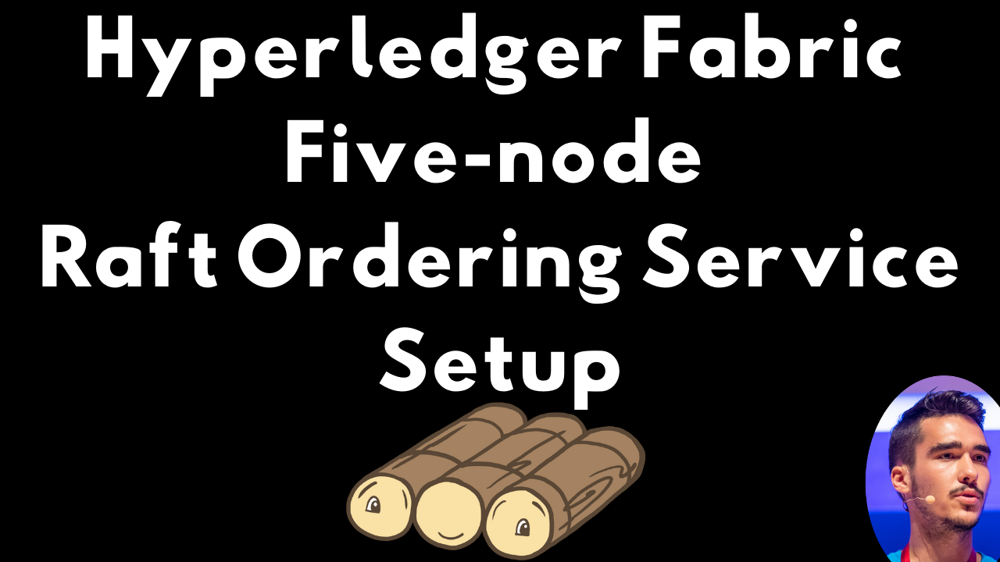
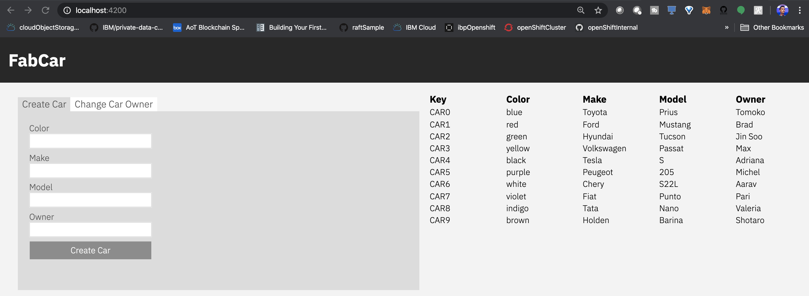

**This code pattern uses only free, open-source technologies.**

# Build and run a smart contract on a Hyperledger Fabric network with the Raft ordering service.

This project demonstrates how to build and submit transactions to a five-node ordering service running 
on the (crash fault tolerant) Raft consensus protocol. This repo makes use of the Fabcar 
chaincode and UI (shown in the gif below).

<br>
<p align="center">
  
</p>
<br>

The five-node ordering service is made up of five separate docker containers, as shown below:

<br>
<p align="center">
  
</p>
<br>

After you submit these transactions, you can see the Raft consensus protocol in action by 
reading the logs from the ordering node containers. For example, the logs from node 1 are 
shown below. First, we can see that a Heartbeat message was received, thus making node 1 
a follower in the present term. Next, you can see the leader is changed to node 5. Lastly,
you can see a block is being written to the ledger channel.

<br>
<p align="center">
  
</p>
<br>

To see Raft in action, we can submit a transaction to the Fabcar UI while the docker logs 
are running. When the docker logs are first shown, we are at block 10. After the create 
car transaction is submitted to the UI, and the nodes agree on the result, the data 
is written into block 11, as shown in the gif below.


Next, we will submit a change car owner transaction, and can see that block number 12 is 
written to the channel once the transaction goes through.


This repo will show you how to build your own Hyperledger Fabric network running a 5-node 
Raft consensus protocol, and submit transactions through the UI shown in the gifs above.
Lastly, this repo will explain the basics behind the Raft protocol.

# Intro to Hyperledger Fabric Consensus
Given that Hyperledger Fabric has several [ordering service implementations](https://hyperledger-fabric.readthedocs.io/en/release-1.4/orderer/ordering_service.html#ordering-service-implementations),
including Solo, Kafka, and Raft, you as the developer should know the advantages 
and disadvantages of each implementation before making a design decision. As the 
new default for production blockchain networks, the Raft consensus algorithm is a 
crash fault tolerant ordering service implementation which is easier to set up and manage 
than Kafka. More importantly, Raft allows different organizations to contribute nodes the ordering service, enabling a more decentralized network architecture.

# Intro to Raft Consensus

Given that there are many possible ways that 
the nodes on a blockchain network may come to agreement (or consensus), and that
agreement is essential for a distributed computing network, it is no surprise that the 
debate over the most efficient consensus algorithm is often heated and even religious.
At the heart of consensus algorithms is solving a difficult, popular, distributed computing 
question: how can we (computers)
agree on one result (reach consensus) among a group of computers when we know that the 
computers are unreliable? Although there is no perfect way to solve this problem, the 
de-facto standard since 1989 has been the Paxos algorithm. The problem with Paxos,
is that it takes Ph.D students years to master, and even the brightest of engineers that 
try to implement this algorithm in practice have difficulties fully understanding, and thus,
implementing their solution. 

Enter Raft. Designed as an alternative consensus algorithm to Paxos, Raft is much easier 
to understand, and is now used in some of the most successful software projects, such as
Docker. Since the start of Hyperledger Fabric, consensus has been designed as pluggable, 
and you the developer get to choose which type of consensus your ordering nodes will use.
Raft enables a much easier setup than Kafka, a more decentralized approach because multiple
organizations can contribute nodes to the ordering service, and greater crash fault 
tolerance than Solo, since Solo features a single ordering node. This code pattern will
help you understand how to build and deploy a smart contract onto a Hyperledger Fabric 
network running Raft, and enable you to test the tolerance of the network by stopping 
and starting some of the ordering nodes.

# Raft Basics
* You need a quorum (majority) of the nodes for the network to operate properly.
* Nodes can be in three states - either a leader, a candidate (asking for votes to become a leader), or a follower
* The leader takes care of updating the state of the network. Each of the nodes in the network
votes on who should be the leader.
* Once election timeout is passed (i.e. a follower doesn't receive any communication for a certain period of time) then
an election is started to choose a new leader.
* Leaders periodically send out heartbeat messages, to maintain their authority over followers.

When the reader has completed this code pattern, they will understand how to:

* Understand how the Raft algorithm works
* Understand how to build and run a Raft ordering service with multiple organizations in Hyperledger Fabric
* Test the ordering service fault tolerance by deleting (crashing) one of the ordering nodes 
* Submit transactions and run a blockchain network on using a Raft ordering service

# Flow Diagram
<br>
<p align="center">


</p>
<br>

# Flow Description
1. The blockchain operator generates cryptographic materials such as public and private keys
for the organizations that will manage the peer nodes.
2. The blockchain operator will bring up the network including five-ordering nodes running Raft, install the smart contract on the peers, and query the network to ensure the contract is working properly.
3. The blockchain operator will install dependencies for the Fabcar web application, including server side, and client side dependencies.
4. The blockchain operator will create a cryptographic identity for the client which
will be submitting transactions via the Fabcar UI, and store that identity in a wallet.
5. The user interacts with the Fabcar Angular web application to update the blockchain state, and the Raft-based ordering nodes use leader election to decide which node will take lead in writing blocks.
6. The user inspects the ordering service logs to ensure that the Raft consensus algorithm
is running as expected.

## Featured technologies
+ [Hyperledger Fabric v1.4.4](https://hyperledger-fabric.readthedocs.io) is a platform for distributed ledger solutions, underpinned by a modular architecture that delivers high degrees of confidentiality, resiliency, flexibility, and scalability.
+ [Docker](https://www.docker.com/) Docker is a set of platform as a service products that use OS-level virtualization to deliver software in packages called containers. Containers are isolated from one another and bundle their own software, libraries and configuration files; they can communicate with each other through well-defined channels.

# Watch the Video - Application Demo Part 1/2

[](https://www.youtube.com/watch?v=Lo9UB_idBto)


# Watch the Video - Application Setup Part 2/2

[](https://www.youtube.com/watch?v=3_SjJ_gNyrk)


## Prerequisites

  - [Hyperledger Fabric 1.4 prerequisites](https://hyperledger-fabric.readthedocs.io/en/release-1.4/prereqs.html) 
  - **Tested on macOS Catalina 10.15.2 with the following versions:** (Note that your prerequisites are different if you use Windows) 
    * Node.js version 8.9.0
    * npm version 6.11.3
    * Docker version 19.03.5, build 633a0ea
    * docker-compose version 1.24.1, build 4667896b


# Steps
1. [Clone the repo](#step-1-clone-the-repo)
2. [Optional Clean your Docker images](#step-2-Optional-Clean-your-Docker-images)
3. [Generate cryptographic material](#step-3-Generate-cryptographic-material)
4. [Install Fabcar web app dependencies](#step-4-Install-Fabcar-web-app-dependencies)
5. [Create a cryptographic identity](#step-5-Create-a-cryptographic-identity)
6. [Start the Fabcar web app](#step-6-start-the-Fabcar-web-app)
7. [Test the network - crash the ordering nodes](#step-7-Test-the-network---crash-the-ordering-nodes)

## Step 1. Clone the repo

**Note: This repo is 78MB. May take some time to clone.**

Clone this repo by issuing the following command in Terminal. Next, navigate to the newly cloned folder.

```
Workdir$ git clone https://github.com/IBM/raft-fabric-sample.git
Workdir$ cd raft-fabric-samples
```

## Step 2. (Optional) Clean your Docker images

You will need to run the following command if you have other Docker containers running from the [IBM-Blockchain VSCode extension](https://github.com/IBM-Blockchain/blockchain-vscode-extension), or any other
projects that are using the same containers on the same ports. Also, if you ran into an error using these scripts in the past, clean your
Docker system with the following commands. Note when asked if you want to continue type in `y`:

```
raft-fabric-samples$ cd first-network/
first-network$ ./byfn.sh down
```

The output will look something like this:

```
Stopping for channel 'mychannel' with CLI timeout of '10' seconds and CLI delay of '3' seconds
Continue? [Y/n] y
proceeding ...
WARNING: Volume net_peer1.org3.example.com not found.
ce79d448de52
044e7437c085
Untagged: dev-peer0.org1.example.com-fabcar-1.0-5c906e402ed29f20260ae42283216aa75549c571e2e380f3615826365d8269ba:latest
Deleted: sha256:aa78a2e101cc6402b6c0ae6b74bb1af0f0935a74ae63e6db42eb5f069729f6b3
Deleted: sha256:1b13efa63dcdf4a7a16d20a1963a2a31a27e39cd0638694df25c7c3d79ed2bd7
Deleted: sha256:53f6681b7a2e123577506b7d8c2d1bad39a67ecd941befe4a2d866b68c63dfb6
Deleted: sha256:7db554b1063d5f151bbc8a6c2eff01bf1e166fbf908543bd221d045d855b091f
Untagged: dev-peer0.org2.example.com-fabcar-1.0-264b0a1cb5efbecaac5cf8990339c24474dc8435c6e10f10f2be565d555d0e94:latest
Deleted: sha256:a291305233a2d3981226d6080fb4252a5419ef5f0bd2e86d11fb427fde4246c7
Deleted: sha256:cae6530ed0696219b471436abbb7a304a880be5031cd016e45bff606a6bcc37a
Deleted: sha256:b916c69c9c1b01e46ef92ac6568900138ae0b84bde36d0755d69f6257bc5aad6
Deleted: sha256:f8386c6e7763a2ab8917d57912b3df0fc37cb844338900313a7c5eb6164de7ea
```

Next, we clean the previous cryptographic certificates on our system is the following command. Note when asked if
you want to continue, type in `y`:

**🚧🚧🚧The command below we clear all docker containers on your system. Only use it
if you are okay with doing this. I use it every time to ensure that the containers that 
are needed for the pattern will work properly, but use at your own discretion.🚧🚧🚧**

```
first-network$ docker stop $(docker ps -a -q)  ; docker rm -f $(docker ps -aq) ; docker system prune -a ; docker volume prune ; docker ps -a ; docker images -a ; docker volume ls
``` 

You will see the following:

```
WARNING! This will remove all local volumes not used by at least one container.
Are you sure you want to continue? [y/N] y
Total reclaimed space: 0B
```

The last thing we need to do if you ran this app before is clean up our previous 
credentials from the wallet directory. Go ahead and delete the wallet from the 
`web-app/server` directory:

```
server$ rm -rf wallet/
```

## Step 3. Generate cryptographic material

Issue the following command to generate the required certificates and genesis block configuration. When asked for if you want to continue
go ahead and type in `y`.


```
first-network$ ./byfn.sh generate -o etcdraft
```
The output will look something like this: 

```
Generating certs and genesis block for channel 'mychannel' with CLI timeout of '10' seconds and CLI delay of '3' seconds
Continue? [Y/n] y
proceeding ...

/Users/Horea.Porutiu@ibm.com/Workdir/testDir/testDec20/raft-fabric-samples2/first-network/../bin/cryptogen

##########################################################
##### Generate certificates using cryptogen tool #########
##########################################################
+ cryptogen generate --config=./crypto-config.yaml
org1.example.com
org2.example.com
+ res=0
+ set +x
```

Next, Start up the Raft network with the following command. This may take a few minutes to execute...

```
first-network$ ./byfn.sh up -o etcdraft -l node
```

The output will look something like this: 

```
Starting for channel 'mychannel' with CLI timeout of '10' seconds and CLI delay of '3' seconds
Continue? [Y/n] y
proceeding ...

LOCAL_VERSION=1.4.4
DOCKER_IMAGE_VERSION=1.4.4
...

===================== Chaincode is installed on peer0.org2 ===================== 

Instantiating chaincode on peer0.org2...
+ peer chaincode instantiate -o orderer.example.com:7050 --tls true --cafile /opt/gopath/src/github.com/hyperledger/fabric/peer/crypto/ordererOrganizations/example.com/orderers/orderer.example.com/msp/tlscacerts/tlsca.example.com-cert.pem -C mychannel -n fabcar -l node -v 1.0 -c '{"Args":["initLedger"]}' -P 'AND ('\''Org1MSP.peer'\'','\''Org2MSP.peer'\'')'
+ res=0
+ set +x
2019-12-20 20:29:42.998 UTC [chaincodeCmd] checkChaincodeCmdParams -> INFO 001 Using default escc
2019-12-20 20:29:42.998 UTC [chaincodeCmd] checkChaincodeCmdParams -> INFO 002 Using default vscc
===================== Chaincode is instantiated on peer0.org2 on channel 'mychannel' ===================== 

Querying chaincode on peer0.org1...
===================== Querying on peer0.org1 on channel 'mychannel'... ===================== 
+ peer chaincode query -C mychannel -n fabcar -c '{"Args":["queryCar","CAR1"]}'
Attempting to Query peer0.org1 ...3 secs
+ res=0
+ set +x

{"color":"red","make":"Ford","model":"Mustang","owner":"Brad","docType":"car"}
===================== Query successful on peer0.org1 on channel 'mychannel' ===================== 

========= All GOOD, BYFN execution completed =========== 


 _____   _   _   ____   
| ____| | \ | | |  _ \  
|  _|   |  \| | | | | | 
| |___  | |\  | | |_| | 
|_____| |_| \_| |____/  

```

## Step 4. Install Fabcar web app dependencies

Next, we need to install the dependencies to run the fabcar UI. In a two separate Terminal window, navigate to the 
client and server directories of the web-app, and run npm install. 

```
first-network$ cd ..
raft-fabric-samples$ cd web-app/client/
client$ npm install
```

```
first-network$ cd ..
raft-fabric-samples$ cd web-app/server/
server$ npm install
```

## Step 5. Create a cryptographic identity
Next, we need to add a reference to our private keys for our Org1 and Org2 of our application, so that we can 
prove to the network that our keys have been generated from a valid certificate 
authority. In step 1, from the `./byfn.sh generate -o etcdraft` command, we created certificates for org1.example.com and org2.example.com which are the organizations that are managing and creating certificates for the peer nodes. These certificates are 
stored in our `crypto-config` directory.

Run the following script from the server folder to assign and change the `connection.yaml` file with the 
correct private keys for our two organizations.

```
server$ ./updateKeystore.sh
```

You should see something like:

```
printing keystore for Org1
Admin@org1.example.com/msp/keystore/22267becaaa439c0953f95f95af3fd6847ca5f5e19cbd33703caaecc48655cd5_sk
updating connection.yaml Org1 adminPrivateKey path with Admin@org1.example.com/msp/keystore/22267becaaa439c0953f95f95af3fd6847ca5f5e19cbd33703caaecc48655cd5_sk
updating connection.yaml Org2 adminPrivateKey path with Admin@org2.example.com/msp/keystore/88d540642e9ddaa51985db76e47c3d0ac72123be91e0f49c1ff9b3f9277b9376_sk
```
 
The script changes the following [line](https://github.com/horeaporutiu/raft-fabric-samples2/blob/master/web-app/server/connection.yaml#L42). It changes The adminPrivateKey path for Org2 as well.

Next, let's run the [enrollAdmin.js](https://github.com/horeaporutiu/raft-fabric-samples2/blob/master/web-app/server/enrollAdmin.js) script to create an identity from our certificate authority and store 
that in our wallet, locally in the `server` directory.

```
server$ node enrollAdmin.js 
```

You should see something like the following:
```
msg: Successfully enrolled admin user admin and imported it into the wallet
```

Nice job! We're ready to start the app now :)


## Step 6. Start the Fabcar web app

Once the dependencies are installed, in the two separate windows, run the following command to start the Angular app, and the Node.js server.

Start the Angular development server:

```
client$ npm start
```

You should see the following output:
```
> client@0.0.0 start /Users/Horea.Porutiu@ibm.com/Workdir/testDir/testDec20/raft-fabric-samples2/web-app/client
> ng serve

** Angular Live Development Server is listening on localhost:4200, open your browser on http://localhost:4200/ **
                                                                                          
Date: 2019-12-20T20:42:18.359Z
Hash: 5989a95598de77388957
Time: 15228ms
chunk {main} main.js, main.js.map (main) 43.1 kB [initial] [rendered]
chunk {polyfills} polyfills.js, polyfills.js.map (polyfills) 241 kB [initial] [rendered]
chunk {runtime} runtime.js, runtime.js.map (runtime) 6.22 kB [entry] [rendered]
chunk {styles} styles.js, styles.js.map (styles) 28.1 kB [initial] [rendered]
chunk {vendor} vendor.js, vendor.js.map (vendor) 3.63 MB [initial] [rendered]
ℹ ｢wdm｣: Compiled successfully.
```

Next, start the Node.js Express server:
```
server$ npm start
```

You should see the following output:

```
> server@1.0.0 start /Users/Horea.Porutiu@ibm.com/Workdir/testDir/testDec20/raft-fabric-samples2/web-app/server
> ./node_modules/nodemon/bin/nodemon.js src/app.js

[nodemon] 1.18.10
[nodemon] to restart at any time, enter `rs`
[nodemon] watching: *.*
[nodemon] starting `node src/app.js`
```

Go ahead and go to localhost:4200 in the browser of your choice to interact with the app. The app 
should automatically refresh and have cars shown as shown in the picture below:

<br>
<p align="center">
  
</p>
<br>


If all goes well, you should see the following output in your Express server:

```
Wallet path: /Users/Horea.Porutiu@ibm.com/Workdir/testDir/testDec21/raft-fabric-samples2/web-app/server/wallet
Transaction has been evaluated, result is: [{"Key":"CAR0","Record":{"color":"blue","make":"Toyota","model":"Prius","owner":"Tomoko","docType":"car"}},{"Key":"CAR1","Record":{"color":"red","make":"Ford","model":"Mustang","owner":"Brad","docType":"car"}},{"Key":"CAR2","Record":{"color":"green","make":"Hyundai","model":"Tucson","owner":"Jin Soo","docType":"car"}},{"Key":"CAR3","Record":{"color":"yellow","make":"Volkswagen","model":"Passat","owner":"Max","docType":"car"}},{"Key":"CAR4","Record":{"color":"black","make":"Tesla","model":"S","owner":"Adriana","docType":"car"}},{"Key":"CAR5","Record":{"color":"purple","make":"Peugeot","model":"205","owner":"Michel","docType":"car"}},{"Key":"CAR6","Record":{"color":"white","make":"Chery","model":"S22L","owner":"Aarav","docType":"car"}},{"Key":"CAR7","Record":{"color":"violet","make":"Fiat","model":"Punto","owner":"Pari","docType":"car"}},{"Key":"CAR8","Record":{"color":"indigo","make":"Tata","model":"Nano","owner":"Valeria","docType":"car"}},{"Key":"CAR9","Record":{"color":"brown","make":"Holden","model":"Barina","owner":"Shotaro","docType":"car"}}]
::1 - - [21/Dec/2019:04:54:03 +0000] "GET /queryAllCars HTTP/1.1" 200 1063 "http://localhost:4200/" "Mozilla/5.0 (Macintosh; Intel Mac OS X 10_15_1) AppleWebKit/537.36 (KHTML, like Gecko) Chrome/79.0.3945.88 Safari/537.36"
```

## Step 7. Test the network - crash the ordering nodes
To test the network and make sure it is actually crash fault tolerant, we will crash one 
of the nodes on purpose, and then submit a transaction to the network to make sure the 
network still works as expected. 

As we have learned - Raft needs a quorum (or a majority) of the nodes to be operational 
for the algorithm to work. In this case, we have five nodes, so we need **at least** three of the 
nodes to be up (3/5).

First, we get the logs of ordering node 4 with the following command to prove 
that it is operating as normal:

```
server$ docker logs -f orderer4.example.com
```
Next, as shown in the gif below, we will stop node number 4. We will use 
the following command to do so: 

```
server$ docker container stop orderer4.example.com
```
We then submit a `createCar` transaction to the network, and will see the transaction still goes through since four out of the five (4/5) nodes
are still operating. As a result, **CAR15** is created. After you have clicked on the
createCar button, as shown below, 
we will check the logs of node number 5, with the following command:

```
server$ docker logs -f orderer5.example.com
```

You should see something like the following:

```
2019-12-27 04:21:39.849 UTC [orderer.consensus.etcdraft] writeBlock -> INFO a065 Writing block [13] (Raft index: 19) to ledger channel=mychannel node=5
```


Similarly, we will stop node number 5. Again, since three out of five (3/5) of the nodes 
are still operating, all will work as expected. As a result, **CAR16** is created.


Lastly, when we stop node three, only two out of five nodes are operating (2/5). This 
means that we do not have a quorum. In this scenario, as shown below, the network 
is unable to reach consensus, and we are not able to update the network with our 
transaction. 


## Conclusion

The logs above show you exactly what is being recorded on the network in terms of who is the leader, the following, who is sending out the heartbeat message, and other important aspects 
of the consensus mechanism. To learn more about the Raft consensus mechanism, I urge you to 
see the white paper, along with the other articles that are in the [related links](https://github.com/horeaporutiu/raft-fabric-sample#related-links) section below. To fully 
learn the intricacies behind the algorithm, you will need to spend a lot of time reading and 
experimenting.

In this pattern, you learned that you can build a five-node ordering service network using the [Build your first network](https://hyperledger-fabric.readthedocs.io/en/release-1.4/build_network.html) script, and modifying it a little bit. You also learned a some 
of the basics behind how Raft works - namely, you learned how Raft uses leaders, voting,
and timeouts to ensure that data is properly stored and propagated across a network. Finally,
you saw that you can check the logs of a Docker container to see all of the Raft consensus 
details such as when leaders are elected, when blocks are written, and when heartbeat 
messages are sent. This should give you a good idea on how to implement Raft on your own
blockchain use case, and why it is useful in the first place. 

If you enjoyed this pattern, please give it a star, since that will help us cater our 
content in the future to your needs. Thanks :) 

## Extending the code pattern
To make the network even more distributed, you could always add more ordering nodes, peers, 
or organizations. For the purpose of this pattern though, you could add more ordering nodes 
to increase the crash fault tolerance.


# Related IBM Developer content
* [Fabcar Code Pattern](https://github.com/IBM/fabcar-blockchain-sample)

# Related links
* [Raft White Paper](https://raft.github.io/raft.pdf)
* [Raft Website - interactive demo](https://raft.github.io/)
* [Build your first network](https://hyperledger-fabric.readthedocs.io/en/release-1.4/build_network.html)
* [Hyperledger Fabric Ordering Service Implementations](https://hyperledger-fabric.readthedocs.io/en/release-1.4/orderer/ordering_service.html#ordering-service-implementations)


## License
This code pattern is licensed under the Apache Software License, Version 2. Separate third-party code objects invoked within this code pattern are licensed by their respective providers pursuant to their own separate licenses. Contributions are subject to the [Developer Certificate of Origin, Version 1.1 (DCO)](https://developercertificate.org/) and the [Apache Software License, Version 2](https://www.apache.org/licenses/LICENSE-2.0.txt).

[Apache Software License (ASL) FAQ](https://www.apache.org/foundation/license-faq.html#WhatDoesItMEAN)
 
